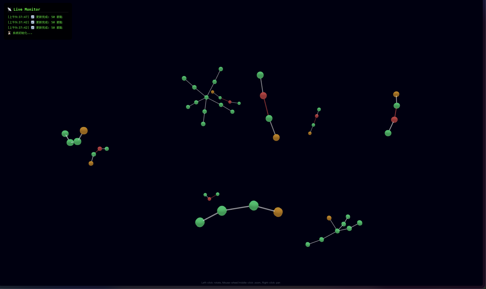
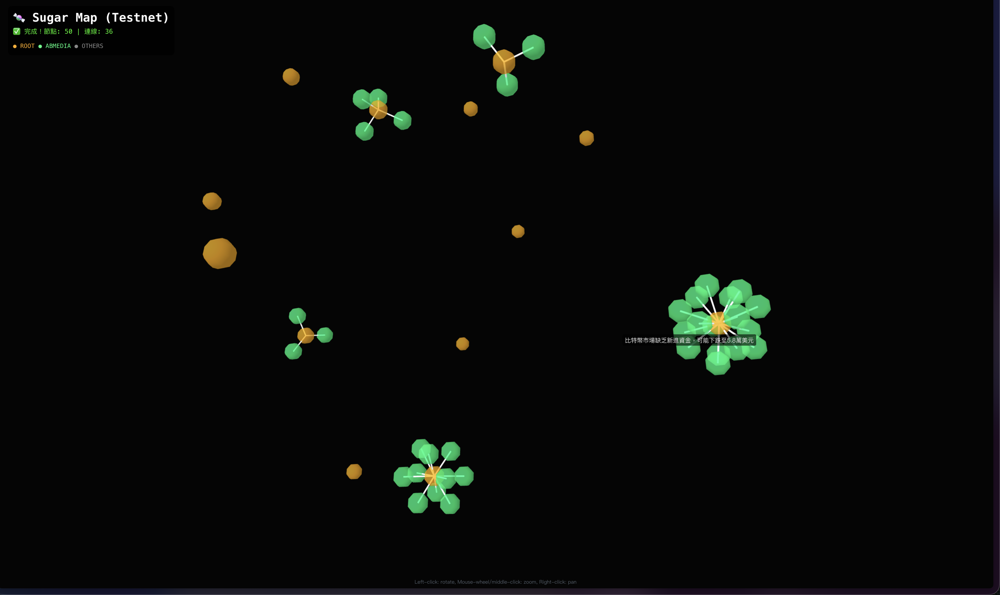

# Sugar Protocol


> **Can the crowd determine what's true?**
>
> Sugar Protocol turns news claims into prediction markets, lets the community stake ETH on whether they're true or false, and uses **Chainlink CRE** to autonomously verify the outcome — creating a decentralized consensus layer for real-world information.



**[Demo Video](TODO)**

---

## The Problem

Discourse has value — and that's exactly why it's under attack. In today's media landscape, controlling the narrative means controlling markets, elections, and public opinion. Social media amplifies unverified claims at scale, and those who dominate the discourse win — regardless of truth.

Traditional fact-checking can't keep up: it's too slow, impossible to scale, and inevitably centralized. There is no systematic, decentralized mechanism for communities to collectively evaluate what's real and reach consensus on contested claims.

## Our Thesis

What if we could use blockchain's immutability and transparency to record the flow of public discourse — and use prediction market economics to filter signal from noise? When telling the truth pays and lying costs money, the crowd becomes the most efficient fact-checker in the world.

## The Solution

Sugar Protocol creates a **Truth Market** — a prediction market specifically designed for real-world claims:

1. **AI extracts claims** from news articles, mapping them into a knowledge graph of entities, stances, claims, and evidence
2. **Anyone can create a market** on a claim by staking ETH — putting skin in the game
3. **The community stakes FOR or AGAINST** — expressing collective belief with real value at risk
4. **Chainlink CRE automatically verifies** — monitoring on-chain events, gathering evidence from multiple sources, and writing a verdict back on-chain
5. **Markets resolve, winners get paid** — correct predictors earn proportional payouts

The result: a self-sustaining system where economic incentives align with truth-seeking, and verification is decentralized and automated.

---

## How Chainlink CRE Powers Sugar Protocol

**Chainlink CRE (Compute Runtime Environment)** is the backbone of our automated verification system. Here's the flow:

```
User creates market (stakes ETH)
         │
         ▼
┌─────────────────────────┐
│  EVM: PredictionMarket  │──── emits MarketCreated event
│  (Sepolia Testnet)      │
└─────────────────────────┘
         │
         ▼
┌─────────────────────────┐
│  Chainlink CRE Workflow │◄─── evm_log trigger detects event
│                         │
│  1. Read claim metadata │     (Sugar API)
│  2. Search for evidence │     (Google Search)
│  3. AI judge verdict    │     (OpenAI GPT-4o-mini)
│  4. Write resolution    │     (EVM on-chain)
└─────────────────────────┘
         │
         ▼
┌─────────────────────────┐
│  EVM: ResolutionRecord  │──── verdict + reasoning stored on-chain
│  (Sepolia Testnet)      │
└─────────────────────────┘
         │
         ▼
┌─────────────────────────┐
│  Market Resolved        │──── winners claim proportional payouts
└─────────────────────────┘
```

### CRE Capabilities Demonstrated

| Capability | How We Use It |
|-----------|---------------|
| **Event-Driven Trigger** | `evm_log` trigger monitors `MarketCreated` events on Sepolia — no polling needed |
| **Multi-Source Computation** | Workflow fetches Sugar API data + Google Search results, then feeds them to OpenAI for cross-referenced verdict |
| **On-Chain Write-Back** | Verdict and reasoning are written to `ResolutionRecord.sol` via EVM transaction |

### Key CRE Files

| File | Purpose |
|------|---------|
| `cre/workflow.yaml` | Workflow definition — evm_log trigger + computation steps |
| `cre-project/sugar-protocol/market-resolver/main.ts` | CRE SDK entrypoint using `EVMClient.logTrigger` |
| `api/routes/resolve.py` | Backend endpoint that provides claim data to CRE |

---

## Architecture

```
┌──────────────┐     ┌─────────────────┐     ┌──────────────────┐
│  News URL    │────▶│  AI Pipeline    │────▶│  3D Knowledge    │
│  Input       │     │  GPT-4o-mini    │     │  Graph (React)   │
└──────────────┘     │  Entity→Stance  │     │  Force-directed  │
                     │  →Claim→Evidence│     │  visualization   │
                     └────────┬────────┘     └──────────────────┘
                              │
                    Claims with market potential
                              │
                     ┌────────▼────────┐
                     │  EVM Prediction │     Users stake ETH
                     │  Market         │◄─── FOR or AGAINST
                     │  (Sepolia)      │
                     └────────┬────────┘
                              │
                     MarketCreated event
                              │
                     ┌────────▼────────┐
                     │  Chainlink CRE  │     Autonomous verification:
                     │  Workflow        │     API + Search + AI Judge
                     └────────┬────────┘
                              │
                     ┌────────▼────────┐
                     │  Resolution     │     On-chain verdict
                     │  Record (EVM)   │     + market payout
                     └─────────────────┘
```

---

## Tech Stack

| Layer | Technology |
|-------|-----------|
| **Oracle / Automation** | Chainlink CRE (Compute Runtime Environment) |
| **EVM Contract** | Solidity — PredictionMarket + ResolutionRecord (Sepolia) |
| **Sui Contract** | Move — Registry, Claim, TruthMarket, Evidence (Sui Testnet) |
| **Backend** | Python 3.12, FastAPI, SQLAlchemy + aiosqlite |
| **AI Model** | OpenAI GPT-4o-mini (JSON mode) |
| **Frontend** | React 19 + Vite 7, react-force-graph-3d, Three.js, ethers.js v6 |
| **Wallet** | MetaMask / OKX Wallet (auto-switch to Sepolia) |

---

## Demo Flow

1. **Connect Wallet** — MetaMask or OKX, auto-switches to Sepolia Testnet
2. **Submit News URL** — AI analyzes the article in real-time (WebSocket progress)
3. **Explore 3D Graph** — Interactive force-directed visualization of entities, claims, and conflicts
4. **Create Market** — Click a claim node, stake ETH to create a prediction market
5. **CRE Verification** — Run `cre workflow simulate` with the TX hash; CRE detects the event, gathers evidence, and produces a verdict
6. **View Result** — Frontend shows "Verified" badge with on-chain resolution



---

## Deployed Contracts

### EVM (Sepolia Testnet)

| Contract | Address |
|----------|---------|
| **PredictionMarket** | `0x8bB67a5c7Ca89Ee759f9f11a216Eb2921e68f7A5` |
| **ResolutionRecord** | `0xCbD2fc2974a121EB373b89B6B9dFa0a1D863e550` |

### Sui Testnet

| Item | Address |
|------|---------|
| **Package (latest)** | `0xdf6f05bc4424ffc1ec027a4badee36d842b83112aa8b29ff50a598d02964e6a7` |
| **Registry** | `0x45197aca531cb7970636fae068212c768a47ab853152df474f3e01bbd9deeab8` |

---

## Project Structure

```
sugar_protocol/
├── contracts/
│   ├── sources/                # Sui Move contracts
│   │   ├── types.move          #   Constants & validators
│   │   ├── registry.move       #   Entity registry (CRUD)
│   │   ├── claim.move          #   Permissionless claim submission
│   │   ├── market.move         #   TruthMarket + staking + payout
│   │   └── evidence.move       #   Evidence linked to claims
│   ├── tests/                  # 29 Move unit tests
│   └── evm/                    # Solidity contracts
│       └── contracts/
│           ├── PredictionMarket.sol   # Market creation + staking
│           └── ResolutionRecord.sol   # CRE verdict storage
│
├── cre/                        # Chainlink CRE integration
│   ├── workflow.yaml           #   Workflow definition (evm_log trigger)
│   └── market_resolver.ts      #   Workflow script
│
├── cre-project/                # CRE SDK project
│   └── sugar-protocol/
│       └── market-resolver/
│           └── main.ts         #   EVMClient.logTrigger entrypoint
│
├── pipeline/                   # AI NLP pipeline
│   ├── fetcher.py              #   URL fetching (Jina Reader + BS4)
│   ├── classifier.py           #   Content classification
│   ├── analyzer.py             #   GPT-4o-mini discourse analysis
│   ├── entity_registry.py      #   Entity deduplication
│   ├── orchestrator.py         #   Pipeline coordinator
│   └── prompts/                #   Prompt templates
│
├── api/                        # FastAPI backend
│   ├── main.py                 #   App entrypoint
│   ├── ws.py                   #   WebSocket real-time updates
│   ├── evm_bridge.py           #   Python ↔ EVM bridge (web3.py)
│   ├── sui_bridge.py           #   Python ↔ Sui bridge
│   └── routes/                 #   REST endpoints
│
├── frontend/src/               # React frontend
│   ├── App.jsx                 #   Main app + wallet connection
│   ├── contracts.js            #   ethers.js contract bindings
│   └── components/
│       ├── Graph3D.jsx         #   3D force-directed graph
│       ├── MarketPanel.jsx     #   Market UI + CRE verification
│       ├── Sidebar.jsx         #   Entity/claim details + create market
│       ├── URLInput.jsx        #   URL submission
│       └── AnalysisProgress.jsx#   Real-time progress display
│
├── tests/                      # 126 Python tests
├── docker-compose.yml
└── cli.py                      # CLI tool
```

---

## Quick Start

### Prerequisites

- Python 3.10+
- Node.js 18+
- OpenAI API key
- MetaMask or OKX Wallet (with Sepolia ETH)

### Setup

```bash
# Clone
git clone https://github.com/KennyLuo0401/sugar-protocol-ChainlinkCRE.git
cd sugar-protocol-ChainlinkCRE

# Backend
python3 -m venv venv && source venv/bin/activate
pip install -r requirements.txt
cp .env.example .env   # Add your OPENAI_API_KEY

# Start API
PYTHONPATH=. uvicorn api.main:app --reload --port 8000

# Frontend (new terminal)
cd frontend && npm install && npm run dev
# Open http://localhost:5173
```

### CRE Simulation

```bash
# After creating a market in the frontend:
cd cre-project/sugar-protocol
cre workflow simulate market-resolver -T staging-settings
# Paste the transaction hash when prompted
```

---

## Testing

```bash
# Python tests (126 passed)
PYTHONPATH=. pytest tests/ -v

# Move tests (29 passed)
cd contracts && sui move test

# Frontend build
cd frontend && npm run build
```

---

## Built By

**Kenny** — Solo builder, Chainlink Convergence Hackathon 2026. Sugar Protocol is built on a simple belief: when truth has economic value, society can reach consensus faster.

---

## License

MIT
